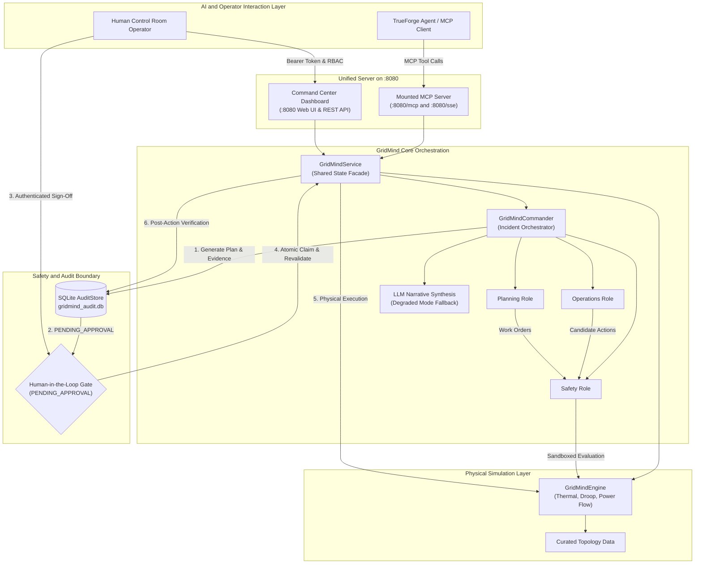

# GridMind

**Agentic Incident-Response System for a Simulated Electrical Distribution Grid**

GridMind pairs an agentic planning workflow built on the **Model Context Protocol (MCP)** and **TrueForge** with a deterministic physical simulator and a mandatory, fail-closed **Human-in-the-Loop Approval Gate**.

---

## What GridMind Is

GridMind is an incident-response system for simulated urban electrical distribution grids. When extreme weather, equipment failures, or demand surges push distribution assets into overload, GridMind reads telemetry through MCP tools, orchestrates specialized domain roles (**Operations**, **Planning**, and **Safety**), simulates candidate interventions in an isolated sandbox, and synthesizes an actionable response plan.

GridMind enforces a strict safety invariant: **AI agents propose and evaluate; human operators authorize; and live grid state is only mutated after verified operator approval and state revalidation.**

```
+----------------------------------------------------------------------------------------------------+
|                                    CORE SAFETY INVARIANT                                           |
|                                                                                                    |
|   TrueForge Agent               GridMind Commander             Control Room Lead      Simulator    |
|   ┌──────────────┐              ┌──────────────────┐           ┌────────────────┐   ┌───────────┐  |
|   │ Propose Plan │ ───────────> │ Sandboxed Eval & │ ────────> │ Authenticated  │──>│ Live Grid │  |
|   │ (via MCP)    │              │ Audit Persistence│           │ Human Approval │   │ Execution │  |
|   └──────────────┘              └──────────────────┘           └────────────────┘   └───────────┘  |
|                                                                                                    |
|   Live physical actions cannot execute without verified operator approval and state revalidation. |
+----------------------------------------------------------------------------------------------------+
```

---

## Architecture Overview

GridMind separates external agent interaction, transport, orchestration, audit persistence, and physical simulation into explicit layers.



### How a Real Incident Flows

1. **Telemetry Inspection**: When an incident occurs (e.g., a transformer temperature $T > 110.0^\circ\text{C}$ or line loading $> 100\%$), the TrueForge agent or operator inspects grid health via `get_grid_state` or `get_incident_state`.
2. **Planning Bridge (`plan_incident_response`)**: TrueForge invokes the `plan_incident_response` MCP tool. This delegates directly to `GridMindCommander`:
   - **Operations Role**: Identifies topology paths and generates operational candidates (`load_transfer`, `load_restriction`, `isolate_transformer`).
   - **Planning Role**: Identifies long-term equipment work orders (`transformer_replacement`).
   - **Safety Role**: Evaluates every candidate in an isolated sandbox clone of the grid to ensure hard constraints (such as hospital 100% power delivery and secondary transformer thermal limits) are preserved.
3. **Deterministic Tie-Breaking**: Safe candidates are ranked by disruption-minimization priority (network transfer $\to$ demand curtailment $\to$ branch isolation) and lowest peak transformer temperature.
4. **Narrative Synthesis**: The LLM client synthesizes concise operator findings and recommendation summaries (with automatic fallback to deterministic templates in `[DEGRADED_MODE]` if API keys are missing).
5. **Durable Audit Record & Status**: Commander records the outcome in SQLite (`gridmind_audit.db`). If an actionable safe intervention is found, the record is placed in `PENDING_APPROVAL` status. If the grid is already stable, it returns `NOMINAL`. If all candidates are unsafe, it returns `NO_SAFE_ACTION`. If automated mitigation is impossible, it returns `ESCALATED`.
6. **Human Operator Sign-Off**: The human operator inspects the evidence, specialist reasoning, and sandbox metrics on the Command Center Dashboard, providing role-authenticated approval.
7. **Atomic Claim & State Revalidation**: Before execution, GridMind verifies that the grid state revision hash matches the planned state. If conditions have drifted, execution is refused (`STALE_STATE`). When valid, SQLite atomically claims the record to prevent race conditions.
8. **Live Execution & Verification**: The action executes on the live simulator, and post-action telemetry is evaluated to confirm grid stabilization (`VERIFIED`).

---

## Why GridMind Needs a Human Gate

Physical power grid operations are safety-critical and irreversible. Tripping a transformer breaker drops downstream customers; closing an overloaded tie-line can trigger cascading feeder lockouts; and curtailing feeders without validation risks critical infrastructure like hospitals.

GridMind enforces strict operational boundaries:
- **No Autonomous Live Execution**: The MCP `execute_action` tool and REST endpoints reject any live action unless an authentic human operator has approved that specific plan.
- **No Synthetic Approval**: The MCP server never manufactures operator identities or treats tool access as human authorization.
- **State-Revision Guard**: If the grid scenario changes or state drifts between planning and approval, the pending plan is transitioned to `STALE_STATE` and execution is refused.
- **Durable Audit Trail**: Every investigation, candidate evaluation, operator identity (`approved_by`), and post-action verification is permanently recorded in SQLite.
- **Fail-Closed Execution**: Mismatched parameters, duplicate execution attempts, and unauthorized tokens fail closed with descriptive errors.

---

## The 7 GridMind MCP Tools

The GridMind MCP server exposes 7 deterministic tools over Streamable HTTP (`:8080/mcp`), Server-Sent Events (`:8080/sse`), and Standard I/O (`stdio`):

| Tool Name | Type | Description |
| :--- | :--- | :--- |
| `get_grid_state` | Read-Only | Telemetry snapshot of all nodes, lines, transformer loadings, temperatures, and active violations. |
| `get_incident_state` | Read-Only | Summarizes active violations, tripped lines, overheated transformers, and unserved critical loads. |
| `evaluate_action` | Sandboxed | Evaluates a candidate action on an isolated deep-copy clone without mutating live grid state. |
| `execute_action` | State-Changing | Executes an intervention on the live simulator (strictly gated by human operator authorization). |
| `get_last_simulation_result` | Read-Only | Retrieves the most recent simulation response. |
| `load_scenario` | Idempotent Reset | Resets simulator state to a clean baseline and loads a scenario (`SC01`, `SC01-B`, `SC02`, `BASE`). |
| `plan_incident_response` | Planning Bridge | Triggers Commander multi-specialist planning and sandboxed safety checks. Returns `PENDING_APPROVAL` with the recommended action when a safe intervention is found, `NOMINAL` if stable, `NO_SAFE_ACTION` if all candidates fail safety checks, or `ESCALATED` if human escalation is required. |

---

## Setup & Running End-to-End

### 1. Prerequisites

- **Python**: Version $\ge 3.11$
- **Node.js / npx**: Required only if running the TrueForge CLI client (`npx @truefoundry/trueforge@latest`)
- **Web Browser**: Modern browser for the Command Center Dashboard
- **LLM API Keys**: *Optional*. GridMind runs in deterministic `[DEGRADED_MODE]` with zero credentials configured.

### 2. Installation

```bash
# Clone the repository
git clone https://github.com/kaamilstudiesig/gridmind.git
cd gridmind

# Create and activate Python virtual environment
python3 -m venv .venv
source .venv/bin/activate

# Install GridMind and dependencies in editable mode
pip install -e ".[dev]"
```

### 3. Environment Configuration

Copy `.env.example` to `.env` and configure your settings:

```bash
cp .env.example .env
```

GridMind supports four provider configurations:

| Provider Option | Environment Variables | Default Endpoint | Default Model |
| :--- | :--- | :--- | :--- |
| **Option A: OpenRouter** *(Default)* | `OPENROUTER_API_KEY` | `https://openrouter.ai/api/v1` | `openrouter/free` |
| **Option B: OpenAI Direct** | `OPENAI_API_KEY` | `https://api.openai.com/v1` | `gpt-4o-mini` |
| **Option C: TrueForge Proxy** | `TRUEFORGE_API_KEY`, `LLM_BASE_URL` | User-defined proxy URL | User-defined model |
| **Option D: Deterministic Mode** | *None (leave blank)* | *N/A (no network requests)* | `[DEGRADED_MODE]` fallback |

> [!NOTE]
> If no LLM credentials are provided, GridMind continues operating without crashing. Specialist safety logic, sandbox simulation, tie-breaking, and execution gating remain 100% functional, using deterministic template narratives.

---

### 4. Start the Application

#### Option A: Unified Command Center & MCP Server (Recommended)

GridMind provides a unified application server where the FastAPI Web Dashboard and the MCP Server run within the **same Python process**. This ensures TrueForge and the human operator share the exact same in-memory `GridMindService`, `GridMindCommander`, and SQLite `AuditStore` instances:

```bash
# Start Unified Server on port 8080
source .venv/bin/activate
python -m dashboard.app --host 127.0.0.1 --port 8080
```

- **Web Dashboard**: `http://127.0.0.1:8080/`
- **Streamable HTTP MCP Transport**: `http://127.0.0.1:8080/mcp`
- **SSE MCP Transport**: `http://127.0.0.1:8080/sse`
- **Health & Tool Discovery**: `http://127.0.0.1:8080/health`

#### Option B: Standalone Headless MCP Server (Testing / Headless)

If you only require the MCP server without the web dashboard UI (e.g. for headless script evaluation):

```bash
source .venv/bin/activate
python -m gridmind.http_server --host 127.0.0.1 --port 8000
```
- **Streamable HTTP MCP Transport**: `http://127.0.0.1:8000/mcp`
- **SSE MCP Transport**: `http://127.0.0.1:8000/sse`

*(Note: Because `GridMindService` state is process-local, for the interactive human-in-the-loop dashboard workflow, run the unified server on port 8080).*

---

### 5. Connect TrueForge CLI

In a second terminal:
```bash
npx @truefoundry/trueforge@latest
```
Configure TrueForge with the Streamable HTTP transport pointing to:
`http://127.0.0.1:8080/mcp`

---

### 6. First Run Walkthrough

1. Open `http://127.0.0.1:8080` in your browser.
2. In TrueForge or via MCP client, load the storm scenario:
   ```json
   load_scenario({"scenario_id": "SC02"})
   ```
3. In TrueForge, call the planning bridge:
   ```json
   plan_incident_response({"scenario_id": "SC02"})
   ```
4. TrueForge receives the generated plan with an incident ID (e.g. `INC-XXXXXXXX`) and status `PENDING_APPROVAL`.
5. Look at the Command Center Dashboard: the pending incident card appears in real time.
6. Click **Approve** on the dashboard (or authenticate with Bearer token `gm-lead-token-secret`).
7. TrueForge or the dashboard executes the action. Telemetry updates and post-action verification confirms stability (`VERIFIED`).

Default Operator Credentials for Dashboard Authentication:
- **Lead Operator**: Bearer token `gm-lead-token-secret` (user: `operator_alice`, role: `operator_lead`)
- **Operator**: Bearer token `gm-operator-token-secret` (user: `operator_bob`, role: `operator`)
- **Viewer**: Bearer token `gm-viewer-token-secret` (user: `viewer_charlie`, role: `viewer`)

---

## TrueForge Planning Bridge (`plan_incident_response`)

### Why the Planning Bridge Exists

Without `plan_incident_response`, an external agent can only query state and run isolated sandbox checks (`evaluate_action`). It cannot produce an authoritative, persistent incident plan.

With `plan_incident_response`, TrueForge acts as an active initiator of the entire GridMind Commander workflow:
1. TrueForge requests incident resolution for the active grid.
2. Commander orchestrates Operations, Safety, and Planning roles.
3. Every candidate is sandboxed and stress-tested against thermal and voltage constraints.
4. An official `AuditRecord` is stored in SQLite. Depending on grid state and candidate viability, the outcome is recorded as:
   - `PENDING_APPROVAL`: When a safe, actionable recommendation is found and awaits operator authorization.
   - `NOMINAL`: When the grid telemetry is already normal and stable with zero violations.
   - `NO_SAFE_ACTION`: When candidate actions were evaluated, but all failed safety constraint checks.
   - `ESCALATED`: When complex multi-equipment damage cannot be resolved automatically.
5. If in `PENDING_APPROVAL`, the plan surfaces on the human operator's dashboard with complete evidence and specialist reasoning.

---

## Scenarios & Incident Lifecycle

### Scenario SC02 (Hero Scenario): Severe Storm & Secondary Overload Prevention

SC02 demonstrates the core power of sandboxed safety verification: **preventing cascading failures by rejecting interventions that cause secondary overloads on adjacent feeders.**

- **What Goes Wrong**: A severe storm strikes the residential sector (`N07` on Feeder-A). Ambient temperature is $28.0^\circ\text{C}$, demand multiplier is $1.15\times$, and residential demand surges by $+50\%$. Transformer `T01` overheats to **$116.63^\circ\text{C}$** at **$124.2\%$** load (limit: $110.0^\circ\text{C}$).
- **The Obvious (Unsafe) Action**: Operations proposes transferring $100\text{ kW}$ over tie-line `L08` to Feeder-B.
- **What Sandbox Proves**: Safety simulates the transfer in sandbox and discovers a **secondary failure**: transferring load to Feeder-B surges transformer `T04` to **$113.76^\circ\text{C}$**, creating a new thermal overload violation. Safety **rejects** the tie-line transfer!
- **The Safe Recommendation**: Safety evaluates $15\%$ load restriction on residential node `N07` (LoadZone `LZ01`), predicting `T01` will cool to **$94.15^\circ\text{C}$** with $0$ secondary violations (and $20\%$ restriction predicts **$87.31^\circ\text{C}$**).
- **Outcome**: The operator approves $15\%$ curtailment on `N07`. The live grid stabilizes at nominal frequency with zero constraint violations.

---

### Scenario SC01-B: Operational Tie-Line & Disruption Minimization

SC01-B highlights disruption minimization when network rerouting is viable.

- **What Goes Wrong**: Summer heatwave with ambient temperature at $34.0^\circ\text{C}$, demand multiplier at $1.15\times$, and commercial demand on `N08` spiking $+12\%$. Transformer `T04` on Feeder-B overheats to **$112.65^\circ\text{C}$** at **$116.22\%$** load. Tie-line `L08` is healthy and available (`OPEN`).
- **Specialist Evaluation**:
  - Safety evaluates $15\%$ load restriction on `N08` (predicts `T04` cooling to $97.55^\circ\text{C}$).
  - Safety evaluates $100\text{ kW}$ load transfer across tie-line `L08` to Feeder-A (predicts `T04` cooling to $95.32^\circ\text{C}$ and `T02` at $85.06^\circ\text{C}$, with zero violations).
- **Tie-Breaking Rule**: Commander selects `load_transfer` because rerouting power over tie-lines causes **$0\%$ customer curtailment** versus dropping power to consumers.
- **Outcome**: Grid stabilizes with full power delivery maintained across all customer zones and $100\%$ critical hospital service.

---

### Scenario SC01: Summer Heatwave with Damaged Tie-Line

- **What Goes Wrong**: Same heatwave conditions ($34.0^\circ\text{C}$, $1.15\times$ demand, `T04` at **$112.65^\circ\text{C}$**), but emergency tie-line `L08` is damaged and locked out (`TRIPPED`).
- **Specialist Evaluation**:
  - Operations suggests `load_transfer` via `L08`.
  - Safety **rejects** `load_transfer` because `L08` is physically tripped.
  - Safety evaluates $15\%$ `load_restriction` on commercial node `N08` (cooling `T04` to **$97.55^\circ\text{C}$** while maintaining $100\%$ power to critical hospital `LZ04`).
- **Outcome**: Commander recommends $15\%$ curtailment. The operator approves, and the grid recovers to stable operation.

---

### Scenario BASE: Nominal Grid Telemetry

- **Telemetry**: Grid operates stably at nominal frequency ($50.00\text{ Hz}$) with zero active violations, all critical loads fully served ($100\%$), and all transformer temperatures operating within their configured limits (peak unit T04 at $82.65^\circ\text{C}$, well below the $110.0^\circ\text{C}$ limit).
- **Commander Behavior**: Commander returns status `NOMINAL` with zero operational actions or false alarms.

---

## Deterministic Physics vs. LLM Narrative

GridMind strictly separates safety-critical computation from natural language generation:

```
+-------------------------------------------------------------------------+
|                         DETERMINISTIC PYTHON                            |
|  - Physical simulator formulas (thermal rise, droop, power flow)        |
|  - Hard constraint violation detection                                  |
|  - Specialist candidate generation                                      |
|  - Sandboxed safety evaluation & tie-breaking ranking                   |
|  - State revision hashing & single-winner SQLite record claiming        |
+-------------------------------------------------------------------------+
                                     │
                                     ▼
+-------------------------------------------------------------------------+
|                           LIVE LLM CLIENT                               |
|  - Synthesizes operator-facing finding and recommendation text          |
|  - Explains trade-offs and physical rationale in clear language         |
|  - Automatic fallback to deterministic templates in [DEGRADED_MODE]     |
+-------------------------------------------------------------------------+
```

The LLM does **not** decide whether an action is safe. Safety is verified entirely by deterministic Python code simulating physical constraints in the sandbox.

---

## Qodo & Copilot Code Review Evidence

Automated code reviews by **Qodo** (PR-Agent) and **GitHub Copilot** identified real bugs and edge cases across the PR lifecycle, all of which were resolved and regression-tested:

| PR | Review Findings & Root Causes | How It Was Hardened & Fixed |
| :--- | :--- | :--- |
| **PR #1** ([#1](https://github.com/kaamilstudiesig/gridmind/pull/1)) | Flat-layout setuptools auto-discovery refused multiple top-level packages (`agent`, `core`, `dashboard`). | Configured `[tool.setuptools.packages.find]` in `pyproject.toml` with explicit `where` and `include` directives. |
| **PR #2** ([#2](https://github.com/kaamilstudiesig/gridmind/pull/2)) | `load_transfer` hardcoded to $0.100\text{ MW}$; missing percentage bounds on `load_restriction`; inconsistent frequency droop baseline. | Fully parameterized `load_transfer` with capacity guards; enforced $0\text{--}100\%$ bounds; formalized `available_generation_mw` droop semantics. |
| **PR #3** ([#3](https://github.com/kaamilstudiesig/gridmind/pull/3)) | Boolean coercion bug on approval dict (`bool("false") == True`); candidate dictionary ordering misalignment; race conditions on approval execution. | Strict `approval.get("approved") is True` check; deterministic UUID `candidate_id` tracking; atomic SQLite record claiming; state-revision verification. |
| **PR #4** ([#4](https://github.com/kaamilstudiesig/gridmind/pull/4)) | Unauthenticated dashboard endpoints; client-supplied `approved_by` identity spoofing; synchronous calls blocking FastAPI event loop. | Bearer token authentication & RBAC; derived `approved_by` from authenticated context; offloaded planning to threadpool via `asyncio.to_thread`. |
| **PR #5** ([#5](https://github.com/kaamilstudiesig/gridmind/pull/5)) | Multiple simultaneous overheated transformers dropped; hardcoded scenario branches in specialist logic. | Refactored candidate generation to handle simultaneous transformer incidents; generalized specialist logic to operate purely from telemetry. |
| **PR #6–#8** ([#6](https://github.com/kaamilstudiesig/gridmind/pull/6), [#7](https://github.com/kaamilstudiesig/gridmind/pull/7), [#8](https://github.com/kaamilstudiesig/gridmind/pull/8)) | Synthetic operator identity in MCP; service instance mismatch across transports; SQLite database locks during polling. | Removed synthetic approval (fail closed); enforced singleton service dependencies; enabled SQLite WAL mode with 30s busy timeout. |

---

## Repository Structure

```
gridmind/
├── dashboard/                  # Command Center web application (FastAPI)
│   ├── app.py                  # REST API routes, RBAC auth, mounted MCP, and event streaming
│   ├── static/                 # CSS styling and frontend JavaScript
│   └── templates/              # Jinja2 HTML templates (index.html)
├── docs/                       # Engineering specifications
│   └── simulation_assumptions.md # Detailed physics, droop, thermal, and feeder math
├── gridmind/                   # Core Python package
│   ├── audit_store.py          # SQLite persistence & atomic single-winner claiming
│   ├── commander.py            # GridMindCommander orchestration & human approval gate
│   ├── contract.py             # Data transfer models & validation schemas
│   ├── engine.py               # Deterministic electrical and thermal simulation engine
│   ├── http_server.py          # Standalone Uvicorn HTTP server exposing Streamable HTTP & SSE MCP
│   ├── llm.py                  # LLMClient with graceful degraded-mode fallback
│   ├── loader.py               # Curated topology & scenario JSON loader
│   ├── mcp_server.py           # MCPServer registration & 7 tool handlers
│   ├── scenario.py             # Scenario definitions (SC01, SC01-B, SC02, BASE)
│   ├── service.py              # GridMindService unified state facade
│   └── specialists.py          # Operations, Planning, and Safety domain roles
├── gridmind_data/              # Synthetic grid models and public evidence
│   └── curated/                # Curated nodes, lines, transformers, and load zones
├── tests/                      # Exhaustive test suite (174 tests, 173 passed)
│   ├── test_commander.py       # Commander planning, approval, and verification tests
│   ├── test_dashboard.py       # Dashboard REST API, RBAC, and UI contracts
│   ├── test_engine.py          # Physical simulator, droop, and thermal formulas
│   ├── test_http_server.py     # Streamable HTTP and SSE MCP transport tests
│   ├── test_loader.py          # Topology and scenario loading tests
│   ├── test_mcp_planning_bridge.py # TrueForge plan_incident_response bridge tests
│   ├── test_mcp_server.py      # MCP tool discovery, annotations, and schemas
│   ├── test_packaging.py       # Wheel distribution packaging and asset tests
│   ├── test_sc01.py            # Scenario SC01 lifecycle test
│   ├── test_sc01_b.py          # Scenario SC01-B tie-line operational test
│   ├── test_sc02.py            # Scenario SC02 storm & secondary overload tests
│   ├── test_service_contract.py# Service contract & sandbox immutability tests
│   └── test_trueforge_execution_gate.py # Security gating & authorization tests
├── .env.example                # Documented template for environment variables
├── pyproject.toml              # Build metadata, packaging data, and dependencies
└── README.md                   # Project documentation and architecture guide
```

---

## Known Limitations

- **Simplified Distribution Physics**: GridMind uses simplified deterministic approximations (DC power flow, empirical thermal rise exponents, linear frequency droop) rather than full AC optimal power flow.
- **Simulated Environment**: GridMind operates on simulated distribution grid topology and curated scenarios rather than live utility SCADA telemetry.
- **Synchronous Specialist Execution**: Specialist roles evaluate sequentially in threadpools rather than as distributed asynchronous workers.

---

## Test Suite Verification

GridMind includes a test suite of **174 unit and integration tests**:

```bash
# Verify Python syntax across all modules
python3 -m py_compile gridmind/*.py dashboard/*.py tests/*.py

# Run tests with pytest
pytest -v

# Run with unittest runner
python3 -m unittest discover tests -v
```

173 tests pass with full coverage across physical simulation, specialist orchestration, MCP tool routing, TrueForge planning bridge, human authorization gating, and dashboard RBAC.

---

## AI Tool Disclosure

Claude (Anthropic) and Google Antigravity were used as AI pair-programming assistants during architecture design, simulation development, and refactoring passes. Automated code reviews were conducted using Qodo (PR-Agent) and GitHub Copilot. All physical equations, safety constraints, human authorization gates, and test suites were verified against electrical distribution engineering specifications.
