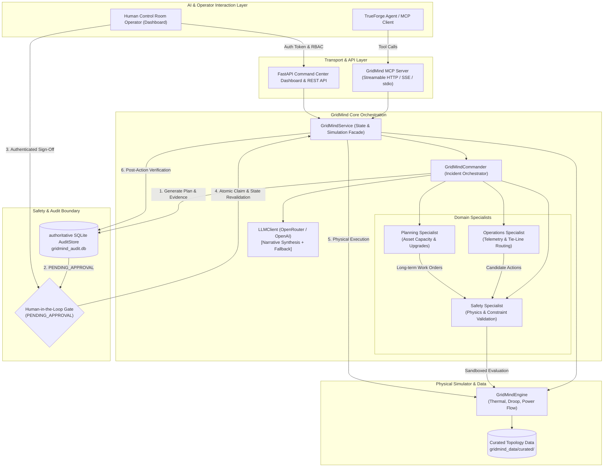

# GridMind

**Agentic Incident-Response System for a Simulated Electrical Distribution Grid**

Built on **TrueForge** and the **Model Context Protocol (MCP)** with a mandatory, fail-closed **Human-in-the-Loop Approval Gate** before any physical grid intervention can execute.

---

## What GridMind Is

GridMind is an autonomous yet safety-gated incident-response system designed for urban electrical distribution grids. When extreme weather, equipment failures, or demand surges push distribution assets into overload, GridMind continuously monitors grid telemetry, orchestrates specialized domain agents (**Operations**, **Planning**, and **Safety**), simulates and stress-tests candidate interventions in a sandbox, and synthesizes an actionable response plan. Crucially, GridMind enforces an uncompromising safety invariant: **AI agents propose and evaluate; human operators authorize; and live grid state is only mutated after verified operator approval and state revalidation.**

---

## Architecture Overview

GridMind couples a fast, deterministic physical simulation engine with a multi-agent orchestration layer, an authoritative SQLite audit store, and a real-time Command Center dashboard.



### The End-to-End Execution Flow

1. **Telemetry & Incident Trigger**: The simulation engine detects out-of-bounds conditions (e.g., transformer overheating $T > 110^\circ\text{C}$, line overload $> 100\%$, frequency deviation outside $49.5\text{--}50.5\text{ Hz}$, or critical load shed).
2. **Multi-Specialist Orchestration**:
   - **Operations Specialist**: Inspects live topology, active feeder load zones, and tie-line availability (`L08`) to generate operational candidates (`load_transfer`, `load_restriction`, `isolate_transformer`).
   - **Planning Specialist**: Evaluates long-term capacity uprates (`transformer_replacement`).
   - **Safety Specialist**: Simulates every candidate in an immutable sandbox clone of the grid to verify that hard constraints (such as hospital 100% power delivery and secondary transformer thermal limits) are strictly respected.
3. **Deterministic Tie-Breaking**: Safe candidates are ranked by disruption-minimization priority (network transfer $\to$ demand curtailment $\to$ branch isolation) and lowest peak transformer temperature.
4. **LLM Narrative Synthesis**: An OpenAI/OpenRouter-compatible LLM synthesizes natural-language findings and recommendation summaries for the operator (with automatic fallback to deterministic templates in `[DEGRADED_MODE]` if API keys are missing).
5. **Authoritative `PENDING_APPROVAL` Record**: A structured `AuditRecord` with a generated ID (`INC-XXXXXXXX`) and state revision hash is saved into SQLite.
6. **Human-in-the-Loop Sign-Off**: An authorized control room operator inspects the evidence, specialist reasoning, and sandbox simulation on the Command Center Dashboard, providing cryptographic/role-verified approval.
7. **Atomic Claim & State Revalidation**: Before execution, GridMind verifies that the grid state revision has not drifted since planning and atomically claims the record in SQLite, preventing race conditions or stale-state execution.
8. **Live Execution & Verification**: The action executes on the live simulator, and post-action telemetry is evaluated to confirm grid stabilization (`VERIFIED`).

---

## Why This Needs a Human Gate

Physical power grid operations are safety-critical and non-reversible. Tripping a transformer breaker drops downstream customers; closing an overloaded tie-line can trigger cascading feeder lockouts; and curtailing industrial or residential feeders without validation risks critical infrastructure like hospitals.

GridMind is architected around a strict fail-closed security boundary:
- **No Autonomous Live Execution**: The MCP `execute_action` tool and REST endpoints reject any live action unless an authentic human operator has approved that specific plan.
- **No Synthetic Approval**: The MCP server never manufactures operator identities or treats tool access as human authorization.
- **State-Revision Guard**: If the grid scenario changes or state drifts between planning and approval, the pending plan is atomically transitioned to `STALE_STATE` and execution is refused.
- **Tamper-Evident Audit Trail**: Every investigation, candidate evaluation, operator identity (`approved_by`), and post-action verification is permanently recorded in SQLite.

---

## Setup & Running It End-to-End

### 1. Prerequisites & Installation

```bash
# Clone the repository
git clone https://github.com/kaamilstudiesig/gridmind.git
cd gridmind

# Create and activate Python virtual environment (Python >= 3.11)
python3 -m venv .venv
source .venv/bin/activate

# Install GridMind and development dependencies
pip install -e ".[dev]"
```

### 2. Configure Environment Variables

Copy `.env.example` to `.env` and configure your API keys:

```bash
cp .env.example .env
```

| Variable | Description | Default |
| :--- | :--- | :--- |
| `OPENROUTER_API_KEY` | OpenRouter API key for LLM narrative synthesis | *Optional (enables live LLM)* |
| `OPENAI_API_KEY` | Alternative OpenAI API key | *Optional fallback* |
| `TRUEFORGE_API_KEY` | Alternative TrueForge LLM proxy key | *Optional fallback* |
| `LLM_BASE_URL` | OpenAI-compatible endpoint URL | `https://openrouter.ai/api/v1` |
| `LLM_MODEL` | LLM model for specialist synthesis | `openrouter/free` |
| `GRIDMIND_AUTH_TOKENS`| Custom operator JSON token mapping | Built-in dev tokens |
| `HOST` / `PORT` | Server host and port | `127.0.0.1` / `8000` |

> [!NOTE]
> GridMind is designed to run seamlessly **without any LLM API keys**. If no credentials are configured, GridMind operates in deterministic `[DEGRADED_MODE]` without crashing.

### 3. Start the MCP Server

```bash
# Start Streamable HTTP & SSE MCP server on port 8000
python -m gridmind.http_server --host 127.0.0.1 --port 8000
```

The server exposes 6 standard MCP tools:
- `get_grid_state` (*read-only*): Inspect live voltages, frequency, line loadings, and transformer temperatures.
- `get_incident_state` (*read-only*): View active violations and unserved load zones.
- `evaluate_action` (*read-only / sandboxed*): Simulate any candidate intervention in an isolated clone.
- `get_last_simulation_result` (*read-only*): Retrieve the most recent simulation response.
- `load_scenario` (*idempotent state reset*): Load scenarios (`SC01`, `SC01-B`, `SC02`, `BASE`).
- `execute_action` (*destructive / gated*): Execute approved intervention on live grid.

### 4. Connect TrueForge

Point TrueForge's MCP configuration at:
- **Streamable HTTP Endpoint**: `http://127.0.0.1:8000/mcp`
- **SSE Fallback Endpoint**: `http://127.0.0.1:8000/sse`

### 5. Start the Command Center Dashboard

In a separate terminal, launch the operator web dashboard:

```bash
python -m dashboard.app --host 127.0.0.1 --port 8080
```

Open `http://127.0.0.1:8080` in your browser. Default operator credentials:
- **Lead Operator**: Bearer token `gm-lead-token-secret` (user: `operator_alice`, role: `operator_lead`)
- **Operator**: Bearer token `gm-operator-token-secret` (user: `operator_bob`, role: `operator`)
- **Viewer**: Bearer token `gm-viewer-token-secret` (user: `viewer_charlie`, role: `viewer`)

---

## Demo Walkthrough: Scenarios & Incident Lifecycle

### Scenario 1: `SC01` — Summer Heatwave with Damaged Tie-Line
1. **Initial Telemetry**: Ambient temperature is $38.5^\circ\text{C}$ with high commercial demand ($1.25\times$). Transformer `T04` overheats to $112.5^\circ\text{C}$ (limit: $110.0^\circ\text{C}$). Tie-line `L08` is `TRIPPED` and unavailable.
2. **Specialist Evaluation**:
   - Operations suggests `load_transfer` via `L08`.
   - Safety Specialist **rejects** `load_transfer` because `L08` is physically damaged (`TRIPPED`).
   - Safety evaluates `load_restriction` on commercial node `N08` at $15\%$ and confirms it cools `T04` to $107.5^\circ\text{C}$ while preserving $100\%$ power to critical hospital `LZ04`.
3. **Approval & Execution**: Commander selects $15\%$ curtailment at `N08`, saves record `INC-XXXXXXXX` in `PENDING_APPROVAL`. The operator signs off on the dashboard, live execution completes, and the grid recovers to stable nominal frequency ($50.00\text{ Hz}$).

### Scenario 2: `SC01-B` — Operational Tie-Line & Disruption Minimization
1. **Initial Telemetry**: Same heatwave condition, but tie-line `L08` is healthy and operational (`OPEN`).
2. **Specialist Evaluation**:
   - Safety accepts both `load_transfer` ($100\text{ kW}$ from Feeder-B `N08` to Feeder-A `N04`) and `load_restriction` ($15\%$).
   - Commander's **deterministic tie-breaking rule** selects `load_transfer` because rerouting power over tie-lines causes $0\%$ customer power curtailment versus dropping load.
3. **Result**: Grid achieves full thermal stability without curtailing a single kilowatt of consumer load.

### Scenario 3: `SC02` — Severe Storm & Secondary Overload Prevention
1. **Initial Telemetry**: Residential storm incident with ambient temperature $28.0^\circ\text{C}$, $1.15\times$ base demand, and $+50\%$ demand spike on residential node `N07`. Feeder-A transformer `T01` overheats to $111.4^\circ\text{C}$.
2. **Specialist Evaluation**:
   - Operations proposes transferring $100\text{ kW}$ across `L08` to Feeder-B.
   - Safety simulates the transfer in sandbox and discovers a **secondary failure**: Feeder-B transformer `T04` spikes to $114.7^\circ\text{C}$, creating a new violation!
   - Safety **rejects** the transfer and validates $15\%$ curtailment on residential node `N07`, cooling `T01` to $100.9^\circ\text{C}$.
3. **Result**: Demonstrates that Safety prevents cascading failures by rejecting interventions that cause secondary overloads on adjacent feeders.

### Scenario 4: `BASE` — Nominal Baseline State
1. **Initial Telemetry**: Grid operates normally at $50.00\text{ Hz}$ with zero violations.
2. **Commander Response**: Commander immediately returns `status: NOMINAL` and does not fabricate unnecessary interventions.

---

## Qodo Code Review Evidence

Across our PR lifecycle, **Qodo** (PR-Agent) and **GitHub Copilot** performed automated code reviews, identifying real bugs and safety gaps that were systematically resolved:

| PR & Commit | Findings & Root Causes | How It Was Hardened & Fixed |
| :--- | :--- | :--- |
| **PR #3** ([#3](https://github.com/kaamilstudiesig/gridmind/pull/3), `31fb828`) | • **Finding 1**: Truthy boolean coercion on approval dict.<br>• **Finding 2/7**: Misalignment between candidate generator and safety evaluations.<br>• **Finding 3**: Concurrent execution race condition in `approve_and_execute`.<br>• **Finding 4**: Missing state-revision revalidation before live execution.<br>• **Finding 5**: Conflation of execution refusal with unstable grid state.<br>• **Finding 6**: Fabrication of recommendations on stable grids. | • Enforced strict `approval.get("approved") is True` check.<br>• Added deterministic `candidate_id` UUID tracking across all specialists.<br>• Implemented atomic SQLite single-winner record claiming (`claimed_records`).<br>• Enforced state-revision hash verification before live dispatch.<br>• Differentiated `EXECUTION_REFUSED` from physical grid instability.<br>• Introduced `NOMINAL` short-circuit on stable telemetry. |
| **PR #4** ([#4](https://github.com/kaamilstudiesig/gridmind/pull/4), `5bb8c60`) | • **Finding 1**: Unauthenticated state-changing dashboard endpoints.<br>• **Finding 2**: Client-supplied `approved_by` operator identity spoofing.<br>• **Finding 3**: Cross-scenario approval execution leak.<br>• **Finding 4**: Synchronous planning calls blocking the FastAPI event loop. | • Added Bearer token authentication & RBAC (`operator_lead`, `operator`, `viewer`).<br>• Derived `approved_by` strictly from authenticated user context.<br>• Enforced scenario scoping and blocked cross-scenario execution.<br>• Delegated synchronous orchestration to threadpool via `asyncio.to_thread`. |
| **PR #5** ([#5](https://github.com/kaamilstudiesig/gridmind/pull/5), `cf4bd91`) | • **Finding 1**: Multiple overheated transformers silently dropped.<br>• **Finding 2**: Hardcoded `scenario_id == "SC02"` branches.<br>• **Finding 3**: Specialist failure on dynamic topology changes. | • Refactored candidate generation to handle simultaneous transformer incidents.<br>• Generalised specialist logic to operate purely from telemetry and bus topology.<br>• Added dynamic tie-line and adjacent feeder capacity inspection. |
| **PR #6** ([#6](https://github.com/kaamilstudiesig/gridmind/pull/6), `f724722`, `d5189f0`) | • **Finding 1**: Synthetic operator identity (`mcp_operator_authorized`) in MCP.<br>• **Finding 2**: `GridMindService` instance mismatch between MCP and Commander.<br>• **Finding 3**: `AuditStore` instance mismatch across layers.<br>• **Finding 4**: Obsolete `PENDING_APPROVAL` records surviving scenario changes. | • Removed synthetic approval; made MCP `execute_action` fail closed without genuine human approval.<br>• Enforced strict `is` dependency invariants in constructors.<br>• Injected unified `AuditStore` across MCP, Commander, and Dashboard.<br>• Implemented atomic transaction invalidating old pending records to `STALE_STATE`. |

---

## Deterministic Physics vs. Live LLM Narrative

GridMind separates **safety-critical logic** from **natural language synthesis**:

```
+-------------------------------------------------------------------------+
|                         DETERMINISTIC PYTHON                            |
|  - Physical simulator formulas (thermal, droop, load sharing)           |
|  - Constraint violation detection                                       |
|  - Specialist candidate generation                                      |
|  - Sandbox safety evaluation & tie-breaking ranking                     |
|  - State revision hashing & atomic SQLite record claiming               |
+-------------------------------------------------------------------------+
                                     │
                                     ▼
+-------------------------------------------------------------------------+
|                           LIVE LLM CLIENT                               |
|  - Synthesizes natural-language operator finding & recommendation text  |
|  - Formats reasoning and trade-offs for human control room leads        |
|  - Graceful fallback to deterministic templates in [DEGRADED_MODE]      |
+-------------------------------------------------------------------------+
```

This ensures that even during LLM API outages, rate limits, or network partitions, GridMind's safety verification, tie-breaking, and execution gating remain 100% deterministic, mathematically sound, and reliable.

---

## TrueForge Integration

GridMind connects to TrueForge via the Model Context Protocol:
- **MCP Server**: Implemented in `gridmind/mcp_server.py` using official MCP Python SDK (`mcp>=2.1.0`).
- **Transports**: Supports **Streamable HTTP** (`/mcp`), **Server-Sent Events** (`/sse`), and **Standard I/O** (`stdio`).
- **Tool Annotations**: Explicitly declares `read_only_hint`, `destructive_hint`, and `idempotent_hint` so TrueForge agents clearly understand tool boundaries.
- **Fail-Closed Gate**: While TrueForge agents can freely investigate and evaluate actions in the sandbox, live physical execution (`execute_action`) is gated by Commander's human approval requirements.

---

## Repository Structure

```
gridmind/
├── dashboard/                  # Command Center web application (FastAPI)
│   ├── app.py                  # REST API routes, RBAC auth, and event streaming
│   ├── static/                 # CSS styling and frontend JavaScript state machines
│   └── templates/              # HTML templates (index.html)
├── docs/                       # Engineering specifications
│   └── simulation_assumptions.md # Detailed physics, droop, thermal, and feeder math
├── gridmind/                   # Core Python package
│   ├── audit_store.py          # Authoritative SQLite persistence & atomic claiming
│   ├── commander.py            # GridMindCommander orchestration & human approval gate
│   ├── contract.py             # Pydantic data transfer models & validation schemas
│   ├── engine.py               # Deterministic electrical and thermal simulation engine
│   ├── http_server.py          # Uvicorn HTTP server exposing Streamable HTTP & SSE MCP
│   ├── llm.py                  # LLMClient with graceful degraded-mode fallback
│   ├── loader.py               # Curated topology & scenario JSON loader
│   ├── mcp_server.py           # MCPServer registration & tool handlers
│   ├── scenario.py             # Scenario definitions (SC01, SC01-B, SC02, BASE)
│   ├── service.py              # GridMindService unified state facade
│   └── specialists.py          # Operations, Planning, and Safety domain specialists
├── gridmind_data/              # Synthetic grid models and public evidence
│   └── curated/                # Verified nodes, lines, transformers, and load zones
├── tests/                      # Exhaustive test suite (160 tests, 100% passing)
│   ├── test_dashboard.py       # Dashboard REST API, RBAC, and UI contracts
│   ├── test_engine.py          # Physical simulator, droop, and thermal formulas
│   ├── test_http_server.py     # Streamable HTTP and SSE MCP transport tests
│   ├── test_mcp_server.py      # MCP tool discovery, annotations, and contracts
│   ├── test_packaging.py       # Wheel distribution packaging and asset tests
│   ├── test_sc01.py            # Scenario SC01 full lifecycle test
│   ├── test_sc01_b.py          # Scenario SC01-B tie-line operational test
│   ├── test_sc02.py            # Scenario SC02 storm & multi-transformer tests
│   ├── test_service_contract.py# Service contract & sandbox immutability tests
│   └── test_trueforge_execution_gate.py # Security gating & authorization tests
├── .env.example                # Documented template for environment variables
├── pyproject.toml              # Build metadata, packaging data, and dependencies
└── README.md                   # Project documentation and architecture guide
```

---

## Test Verification

GridMind includes a comprehensive test suite of **160 unit and integration tests**:

```bash
# Verify clean Python compilation across all modules
python3 -m py_compile gridmind/*.py dashboard/*.py tests/*.py

# Run the complete test suite with pytest
pytest -v

# Run with unittest runner
python3 -m unittest discover tests -v
```

All 160 tests pass with zero failures and zero warnings.

---

## AI Tool Disclosure

Claude (Anthropic) and Google Antigravity were used as AI pair-programming assistants during the architecture design, simulation development, and refactoring passes of this project. Automated code reviews and security audits were conducted using Qodo (PR-Agent) and GitHub Copilot. All mathematical formulas, physical constraints, safety gates, and test suites were verified against electrical distribution engineering specifications.
