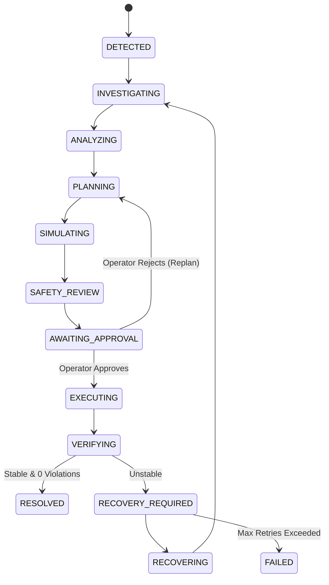

# GridMind Architecture & System Design

## 1. System Overview

**GridMind** is an autonomous multi-agent incident-response and decision-support system designed for electrical distribution grids (calibrated to an urban Bengaluru-inspired 66kV / 11kV / 0.415kV network).

The system transforms raw telemetry and hard constraint breaches into explainable, safety-verified recovery actions with mandatory human approval before live grid execution.

```
                                 OPERATOR / USER
                                       │
                                       ▼
                       GRIDMIND COMMAND CENTER (UI)
                                       │
                                       ▼
                        INCIDENT COMMANDER (AGENT)
                                       │
              ┌────────────────────────┼────────────────────────┐
              ▼                        ▼                        ▼
        GRID ANALYST           SIMULATION AGENT           SAFETY AGENT
       (Telemetry &             (Counterfactual            (Constraint &
        Root Cause)                Sandboxes)            Cascading Check)
              │                        │                        │
              └────────────────────────┼────────────────────────┘
                                       │
                                       ▼
                               DECISION ENGINE
                          (Multi-Objective Scoring)
                                       │
                                       ▼
                            HUMAN APPROVAL GATE
                           (Mandatory Checkpoint)
                                       │
                           ┌───────────┴───────────┐
                           ▼                       ▼
                        APPROVE                 REJECT
                           │                       │
                           ▼                       ▼
                     EXECUTE ACTION             REPLAN
                           │
                           ▼
                    POST-VERIFICATION
                           │
                 ┌─────────┴─────────┐
                 ▼                   ▼
              STABLE              UNSTABLE
                 │                   │
                 ▼                   ▼
             RESOLVED          RECOVERY LOOP
```

---

## 2. Component Layers

### A. Core Engine (`gridmind/engine.py`)
- **Deterministic Approximations**: Simplified DC power flow, capacity allocations, transformer thermal rise ($T = T_{\text{ambient}} + 60 \cdot (\text{load}\% / 100)^{1.8}$), and frequency droop ($f = 50.0 - 0.40 \cdot \Delta P / P_{\text{gen}}$).
- **Hard Constraints**: Frequency ($[49.5, 50.5]\text{ Hz}$), Line Loading ($\le 100\%$), Transformer Hot-Spot ($T \le 110^\circ\text{C}$), Critical Facility Power ($\ge 100\%$).
- **Isolation Invariance**: `evaluate_sandbox()` uses isolated deep-clones to evaluate counterfactuals without mutating live state.

### B. Service Contract (`gridmind/service.py`)
- Standardized API surface: `get_grid_state()`, `get_incident_state()`, `evaluate_action()`, `execute_action()`, `get_last_simulation_result()`, `load_scenario()`.

### C. Protocol Layer (`gridmind/mcp_server.py` & `gridmind/http_server.py`)
- **Model Context Protocol (MCP 2.1)**: Exposes standard MCP tools over both Streamable HTTP (`/mcp`) and SSE (`/sse`, `/messages`).
- **REST & WebSocket API**: Fast, typed REST endpoints for dashboard controls and streaming telemetry.

### D. Autonomous Multi-Agent Layer (`agent/`)
1. **Grid Analyst (`agent/grid_analyst.py`)**: Root cause hypothesis generation and affected asset identification.
2. **Simulation Agent (`agent/simulation_agent.py`)**: Candidate strategy generation and sandbox simulation.
3. **Safety Agent (`agent/safety_agent.py`)**: Independent veto authority checking critical facilities and cascading failures.
4. **Incident Commander (`agent/incident_manager.py`)**: Incident lifecycle orchestration, human checkpoint gating, and recovery loops.

### E. Mission Control Dashboard (`dashboard/static/`)
- Single-page application with dark theme, real-time SVG grid topology, telemetry instrumentation, plan comparison matrix, human approval modal, and live audit stream.

---

## 3. Incident Lifecycle State Machine


